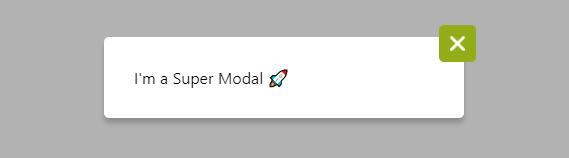

# @royframery_openclassrooms/modal

> package to handle a modal

[](https://www.npmjs.com/package/@royframery_openclassrooms/modal) [](https://standardjs.com)



## Install

```bash
npm install --save @royframery_openclassrooms/modal
```

## Usage
---
```jsx
import React, { useState } from 'react'
import './App.css'

import { Modal } from '@royframery_openclassrooms/modal'
import '@royframery_openclassrooms/modal/dist/index.css'

export const App = () => {
    const [isOpen, setIsOpen] = useState(false)

    const openModal = () => {
        setIsOpen(true)
    }

    const afterOpenModal = () => {
        console.log('Boo 👻')
    }
    const afterCloseModal = () => {
        console.log('Good Bye Modal... 😿 ')
        setIsOpen(false)
    }

    return (
        <main className='main'>
            <button className='main__button' onClick={openModal}>
                Save
            </button>
            <Modal
                content={"I'm a new content ! 💃"}
                isOpen={isOpen}
                afterOpenModal={afterOpenModal}
                afterCloseModal={afterCloseModal}
                wrapperStyle={{ backgroundColor: 'rgba(255, 127, 0, 0.3)' }}
                modalStyle={{ width: '50%', borderRadius: '10px' }}
                contentStyle={{ color: '#ff7f00' }}
                closeButtonStyle={{
                    backgroundColor: '#ff7f00',
                    top: '-20px',
                    right: '-20px',
                    borderRadius: '50%'
                }}
                iconStyle={{ width: '30px', height: '30px' }}
                iconSrc='/cactus.svg'
            />
        </main>
    )
}
```

## Props
---
Common props you may want to specify include:

### __Is required__
- ```isOpen```: The default behavior of the modal. 
  - Format : Boolean

### __Is Not required__
- ```content```: The content of the modal. Can be a string, dom elemnt or a React component.
  - Default : `I'm a Super Modal 🚀`
  - Format: 
    ```jsx
    <Modal content={string} />
    <Modal content={<p>dom element </p>} />
    <Modal content={<MyComponent />} />
    ``` 
- ```afterCloseModal```: A fonction to execute before opening the modal
- ```beforeOpenModal```: A fonction to execute after closing the modal
- ```wrapperStyle```: The style of the main wrapper which is a dom element. [React inline Style](https://reactjs.org/docs/dom-elements.html#style)
- ```modalStyle```: The style of the modal which is a dom element. [React inline Style](https://reactjs.org/docs/dom-elements.html#style)
- ```contentStyle```: The style of the content in the modal which is a dom element. [React inline Style](https://reactjs.org/docs/dom-elements.html#style)
- ```closeButtonStyle```: The style of the modal's close button which is a button element. [React inline Style](https://reactjs.org/docs/dom-elements.html#style)
- ```iconStyle```: The style of the close button's icon which is a img element. [React inline Style](https://reactjs.org/docs/dom-elements.html#style)
- ```iconSrc```: The src of the icon

## License

MIT © [Yorgamaton](https://github.com/Yorgamaton)
